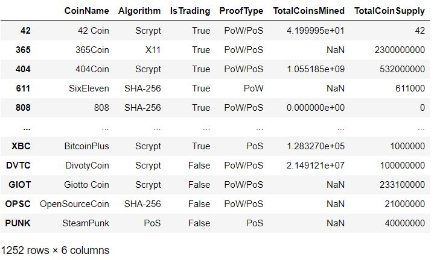
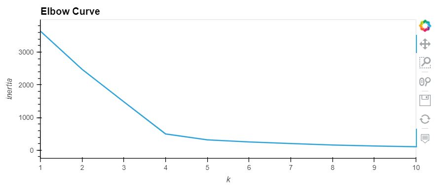
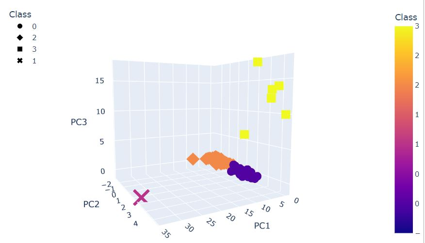
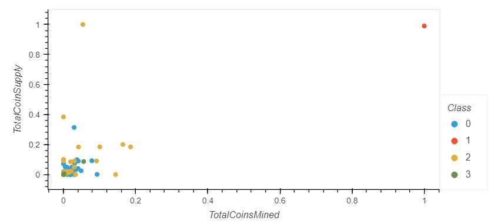

# Cryptocurrencies - An Upsupervised Machine Learning Analysis  

## Overview
Using unsupervised machine learning analysis techique, we will classify and visualized a database of 1,252 cryptocurrencies. 
 

## Process
We first performing the ETL (Extract, Transform, Load) process on the [raw cryptocurrencies dataset.](crypto_data.csv) 

**Raw Cryptocurrencies Dataset** 

 

We then apply the PCA data processing technique followed by the K-Means method to determine 4 clusters as the optimal grouping choice. 

## Visualization

We demonstrate two ways to visualized the four grouping of the resulting 533 cryptocurrencies.

**3D-PCA**  
Four clusters of cryptocurrencies plotted against the three PCA dimensions we used in our analysis 

 

**Supply and Mined** 
Four clusters of cryptocurrencies ploted in relationship to their total supply and total mined numbers  

